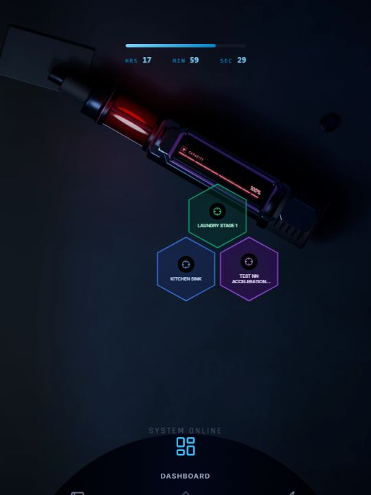

# LifeQuest

LifeQuest is a tabletop-inspired personal operating system that turns intentions into quests, recurring protocols, and measurable daily progress. Assistant actions can become concrete tasks and routines, while the spatial interface keeps the resulting work visible and actionable.

> **Status:** Functional and actively evolving. The core quest, protocol, health, budget, stats, local persistence, and cloud-sync flows are in place, with the interaction design and assistant-action layer continuing to develop.



*The tabletop dashboard turns active goals into a visible, spatial board.*

## Features

- **Dashboard** — See today’s focus, progress, rewards, and activity at a glance.
- **Quests** — Create, prioritize, complete, and manage one-off tasks.
- **Protocols** — Build recurring habits with completion history and rewards.
- **Health and budget** — Track calories, spending, stipends, and earned credits.
- **Stats** — Review quest velocity, protocol consistency, and overall progress.
- **Local-first data** — Use the app locally, with optional Firebase authentication and cloud sync.
- **Installable PWA** — Use LifeQuest as a standalone app on supported devices.

## Tech stack

React · Vite · Tailwind CSS · Framer Motion · Firebase · Recharts · Vitest

## Getting started

### Prerequisites

- Node.js 20 or newer
- npm

### Run locally

```bash
npm ci
```

Copy `.env.example` to `.env.local` and add the Firebase and LifeQuest access values when authentication or cloud sync is needed. The app can still run locally without Firebase configuration.

Start the development server:

```bash
npm run dev
```

Then open [http://localhost:5173](http://localhost:5173).

## Available commands

| Command | Purpose |
| --- | --- |
| `npm run dev` | Start the development server. |
| `npm run build` | Create a production build. |
| `npm run preview` | Preview the production build locally. |
| `npm run lint` | Run ESLint. |
| `npm test` | Run the application test suite. |
| `npm run validate:production-env` | Check required production configuration. |

## Deployment

The application is deployed to GitHub Pages through [`.github/workflows/deploy.yml`](.github/workflows/deploy.yml). Configure the values documented in `.env.example` as repository or environment secrets before deploying.

## Documentation

See the [technical documentation](rules/documentation/index.md) for architecture, components, state management, game systems, and cloud sync details.
